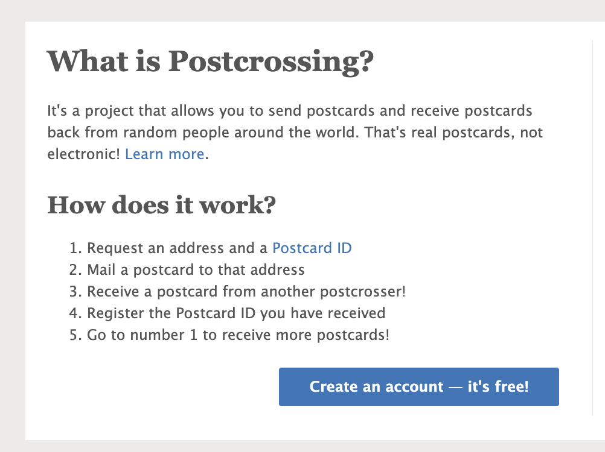
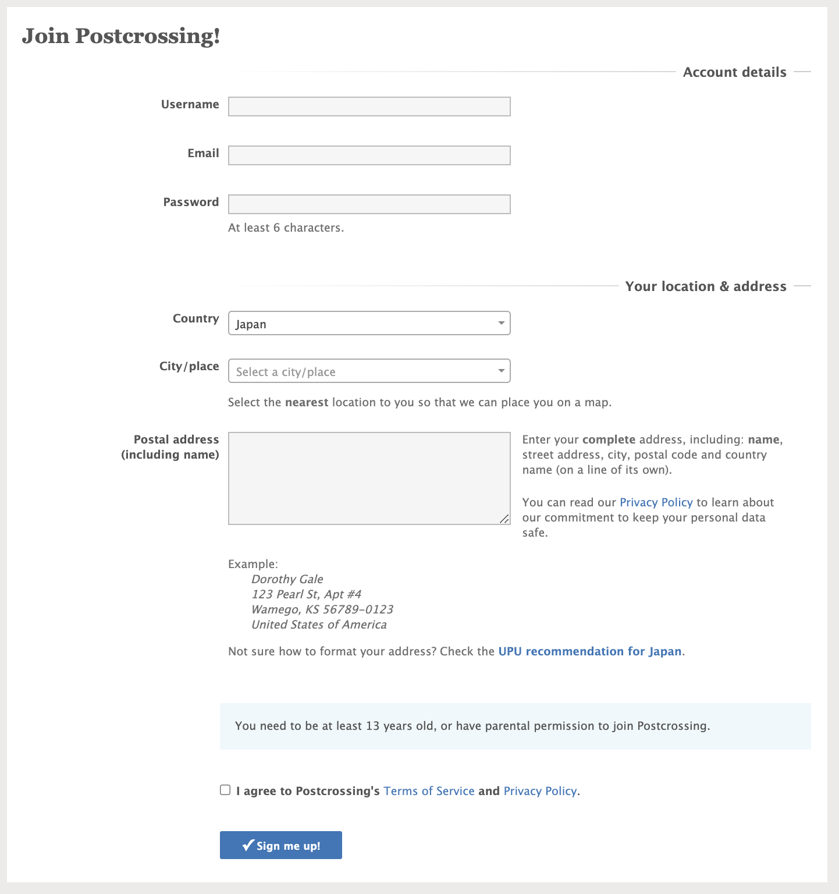

## Postcrossingとは？

Postcrossingとは世界中の人とポストカード交換ができるオンラインプロジェクトです。各国にユーザーを持ち、ランダムに引いた住所宛にメッセージを書いたポストカードを送ります。また知っている国や行ったことのない遠くの国から日本にいる自分のポストあてにカードが送られてきて楽しいです。

Postcrossingの一番のよいところは、日本から海外へ送る場合はどの国でも一律70円（2021年現在）で送れます！  
なので、切手代とポストカード代で数百円から新しい趣味をはじめることができます！  
また英語で自己紹介したり、日本やポストカードの絵について説明するので英語学習としても効果が期待できます。

## Postcrossingのしくみ

やり方は簡単で、まず最初に住所をひきます。相手の住所を引いたら、その住所宛に送りたいカードを選び、住所と一緒に出てきたPostcard IDを書いて送ります。
たったこれだけ！あとはカードを受け取った相手がPostcard IDを登録してくれます。1つのIDが登録されるとまた1枚ポストカードを送れるようになります。

またデイリーポータルZの[こちらの記事](https://dailyportalz.jp/kiji/what-is-postcrossing)でも紹介されています。

## Postcrossingの使い方

  
まずはアカウントをつくりましょう。  
ユーザー登録画面では、まず最初にユーザー名、メールアドレス、パスワードなどの基本情報と、国を含めた住所を記入します。  

あなたの住所を見ることができるのは、住所を引いた相手のみなので世界中のユーザーが閲覧できるわけではありません。住所を教えるのに抵抗がある方は、郵便局で私書箱をつくってそれを利用しましょう。

英語での住所は下記のように書きます。

> Hanako Tanaka  
> Room 103  
> 1-2-34 Koushien  
> Nishinomiya  
> Tokyo  
> 123-4567  
> JAPAN  

1. 氏名
2. 部屋番号・建物名
3. 番地
4. 市
5. 都道府県
6. 郵便番号
7. 国

上記の順番で書きます。またPostcrossingでポストカードを送る場合は、こちらの住所は記入しなくても構いません。  
もし記入するのであれば、相手の住所の前に`To:`をつけて宛名面の一番上に書き、自分の住所には`From:`を書いて相手の宛名より下に書きます。

英語での宛名の書き方は[日本郵便の公式サイト](https://www.post.japanpost.jp/int/ems/greeting/howto/address.html)も参考にしてください。

ここまでアカウントの登録は完了です。つぎはプロフィールを書いてみましょう。